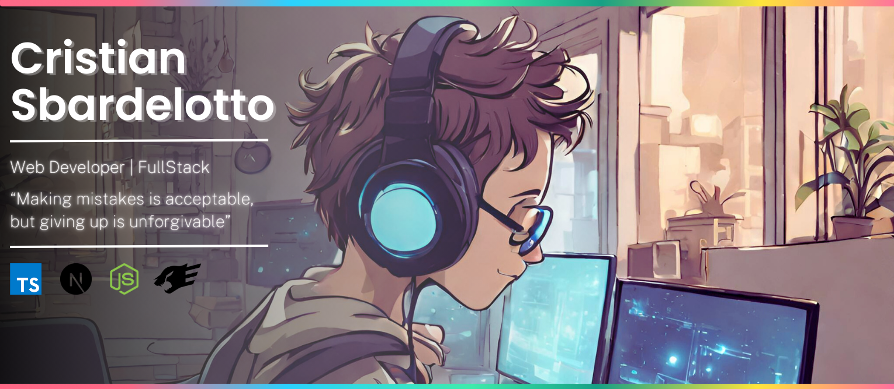

<!--  -->

  
  
   
  
  
  

 

## Technologies that I use in my everyday:

 

  

    
    
    
    
    
       
    
    
    
    
    
  

 

## Technologies that I had contact:

 
  

    
          
    
  

 

## Complementary technologies:

 
 

  
  
  
  
      
  

  

## About me:

Hello! My name is Cristian Sbardelotto, and I am a FullStack Developer. I started studying Web programming in August 2022, and since then, I feel more and more inspired and willing to pursue my career in the area.    
My current goal is to get my first job and, in the future, become a Tech Lead.   
My main technologies are Javascript/Typescript, React, NextJS, TailwindCSS, NodeJS, and Prisma + Fastify.    

Check out my [portfolio](https://bit.ly/portfolioSbardelotto)!

 

<h2 align='center'>Contact me</h2>

