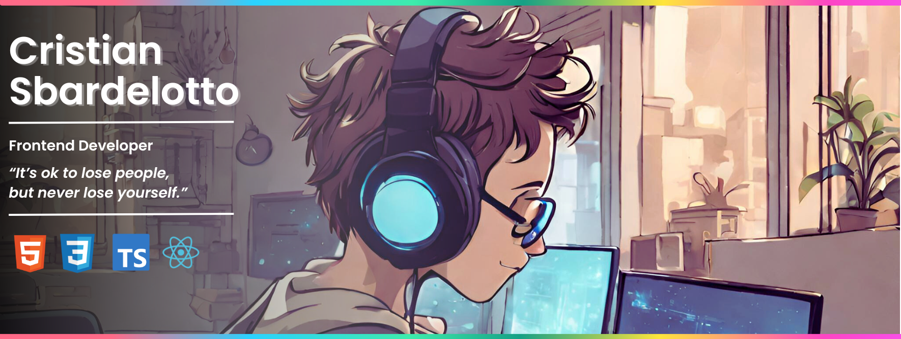

<!--  -->

  
  
   
  
  
  

 

## My Stack:

## About me:

- 👋 Hello! My name is Cristian Sbardelotto and I am a FullStack Developer.   
- 🧠 My current goal is to get my first job and, in the future, become a Tech Lead.  
- 🧑‍💻 My main stack is HTML, CSS, Javascript, Typescript, React, NextJS, TailwindCSS, NodeJS, Prisma, Fastify, Express. 
- 🧑🻠I always try to be a polite and respectful person, and I love interacting with new people and sharing my story. 
- 💬 Want to talk about technology, games or sports? Send a message!
- 💻 Check out my [portfolio](https://portfolio-chi-lemon-51.vercel.app/)!

 

## Contact me:

